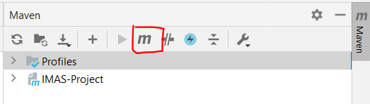
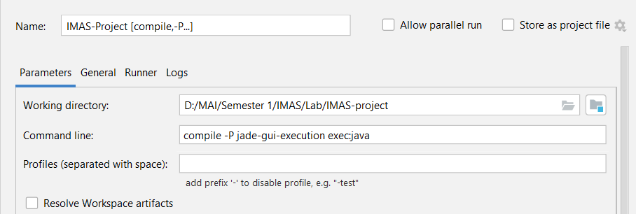
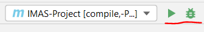
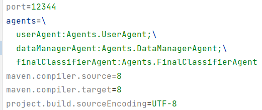
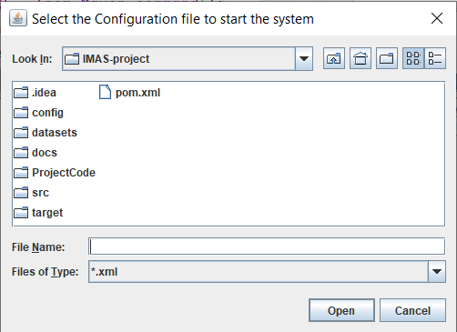

# IMAS-Project
Semestral project for fulfilment of the course _Introduction to Multi-Agent Systems_.

## Goal
The main goal of this project is to create an agent-based decision support
system (A-DSS) to classify UCI repository's AUDIT data into whether the firm is fraudulent or not - based on the historical & current risk factors.

The classification task is a collaboration between multiple "classifier agents", and the disparities between them are expected to be handled by various coordination & negotiation protocols covered in the theory of IMAS.

Details of the minimum requirements of implementation and evaluation criteria can be found in _docs/MAS-practical_work_222.pdf_.

## Requirements
- Maven 3+
- Java 7+ (Java 8 Recommended)

## Dependencies used
- JADE v4.5.0
- JADE Test Suite v1.13.0
- Lombok v1.18.22 _//for auto-generating getters/setters_
- Apache slf4j v1.7.32 _//for logging_
- Weka v3.8.5 _//for J48 decision trees_
- Properties Maven Plugin v1.0.0 _//to read properties file in pom.xml_

## Execution instructions
### Windows
1. On the right panel, open Maven, click on "Execute Maven Goal":

    
2. Run goal: ```mvn clean install```
3. Add the following run/debug configuration:
`compile -P jade-gui-execution exec:java`

    
4. Run the config:

    

    _P.S. doing a clean install isn't required everytime unless there have been some changes in dependencies/plugins or the way properties are loaded._

    _P.P.S. the MAS takes properties from the properties file src/resources/adss.properties instead of directly specifying in pom.xml. We feel this is a cleaner and more modular way to specify the same._

    

5. Once the MAS is up, it will prompt for the configuration file to start the system. This file is used to configure the ADSS system like the no. of classifiers, location of the training & validation dataset, no. of attributes & instances used for training & validation. The basic config can be found at _`config/config.xml`_.

    

6. The system has 2 phases:
- Training
- Querying

In both these cases, the inputs are a list of instance numbers (0-49, inclusive) and a list of attributes - which would be used to classify the instances.

Once the training phase is completed after providing the system configuration, there are further 2 ways to do the querying (or "testing" the ADSS Classifier):
1. Via a testing config - provided as xml
2. Via 15 randomly selected instances & 20 attributes by the system during runtime

Type `1` or `2` in the console. If you select `1`, you will be prompted to select the config file. The file can be found at `config/testQuery.xml`.


## Results
The performance of the ADSS Classifier could be viewed in the logs:


And the results of the predictions are shown as follows: 


Secondly, the communication between the different types of agents could be viewed via the JADE GUI:


